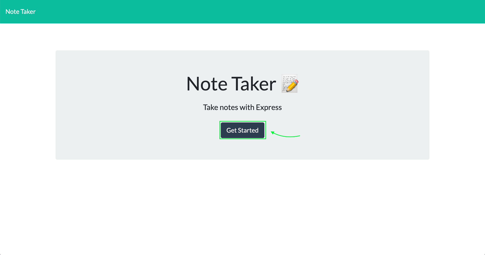
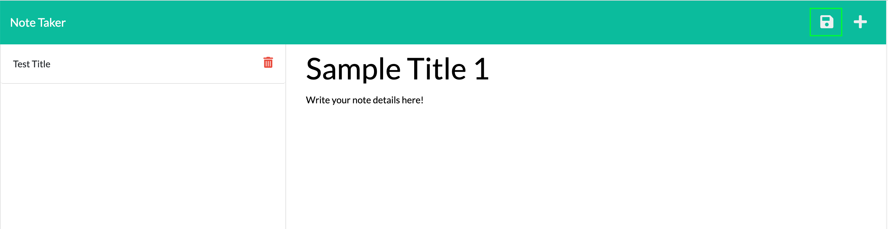
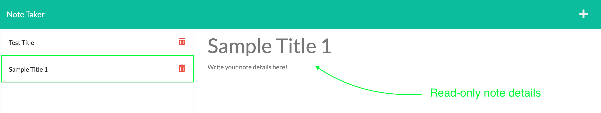
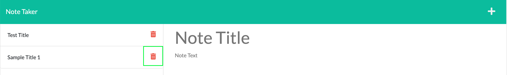

# Note Taker 2000

## Description

This project was my first opportunity to connect a front-end javascript application to a back-end server. 

Throughout this project, I enhanced my understanding of API routes using the express.js router function. I also learned how to create a UUID and store JSON data to a persistent file. A secondary benefit of this project is a deeper understanding of promises and how to leverage helper functions/utilities to simplify the readability of my code.

## Badges

 

## Table of Contents

- [Installation](#installation)
- [Usage](#usage)
- [License](#license)
- [Contributing](#contributing)
- [Tests](#tests)
- [Questions](#questions)

## Installation

This application is hosted on Heroku at the following URL ____________. To download the source code, clone the repository to your local machine. Once complete, open your integrated terminal from the root folder and use the ```npm i``` command to install all of the package dependencies required for the application.

## Usage

When you first open the application, you will be presented with a generic landing page. Click the "Get Started" button to launch the application. 



Upon clicking the button, the app will display any of the notes that have previously been saved to the JSON file. Click the + icon to create a new note, then enter a title and description. Once both fields are populated, the application will present a save icon to save your note data to the JSON file. 



Saving the note will cause it to display on the left side of the page. Click any note to view a read-only version of the details. 



If you would like to delete a note, click the red trash can icon on the right side of any note.



## Credits

This project would have been near impossible for me to create from scratch given my skillset at the time of initial completion. I heavily leveraged the code base from the DU coding bootcamp's express.js mini project. 

The solved code from that assignment combined with the starter code given for this application taught me a ton about how I could be structuring my code better. It also introduced me to new node packages that I wouldn't have otherwise been aware of.

## License

This project is licensed under the terms of the [MIT license](https://choosealicense.com/licenses/mit/).

## Contributing

All feedback is welcome on how this application could be improved.

## Tests

There are no tests for this application.

## Questions

This application was created by [Chris Leavengood](https://github.com/Cleave13). Any questions related to this application can be sent to chriseavengood@gmail.com